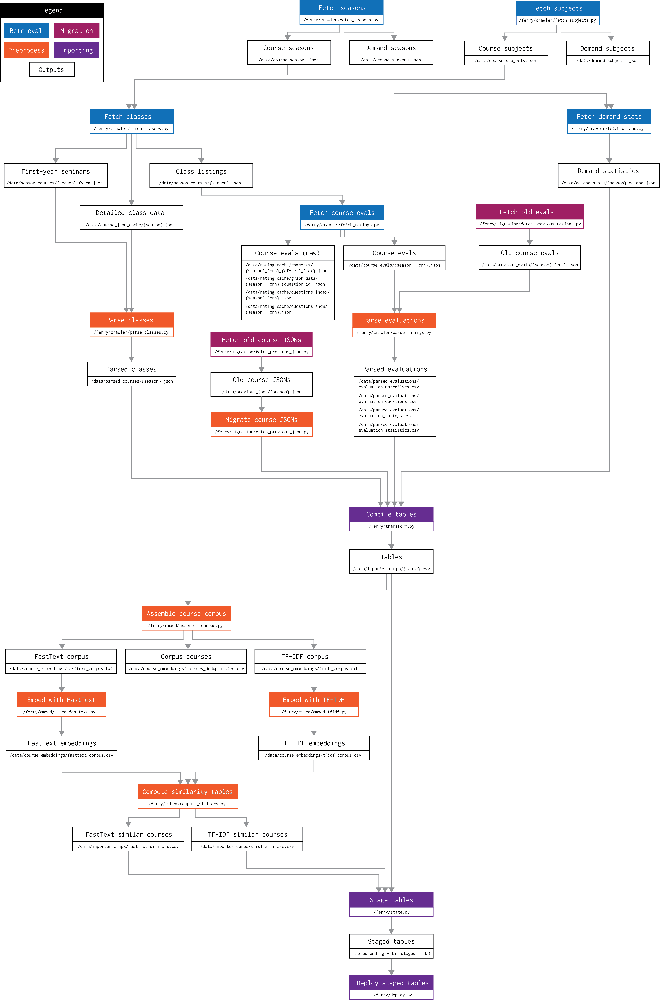

# Ferry

A crawler for Yale courses and evaluation data. Integrates with Coursetable.

## Table of contents
<!--ts-->
   * [Design](#design)
   * [Dependencies](#dependencies)
   * [Usage](#usage)
   * [Data files](#data-files)
   * [Starting from scratch](#starting-from-scratch)
   * [Contributing](#contributing)
   * [TODO](#todo)
<!--te-->

## Design



(see also: [PDF version](./docs/architecture.pdf))

We want the crawler to be reproducible and reliable. As such, we designed the crawling pipeline as a number of stages able to be independently inspected and rerun.

1. **Retrieval**: We pull and preprocess raw data from Yale's websites to fetch the following:
   - Course listings
   - Course demand statistics
   - Course evaluations

2. **Preprocessing**: We preprocess course listing files and evaluations to make them easier to import.

3. **Importation**: We import the preprocessed data files into our Postgres database.

Retrieval is documented in the [retrieval docs](docs/1_retrieval.md) and implemented in the `/ferry/crawler` directory along with preprocessing. We also needed to migrate data from the previous CourseTable databases in a similar fashion. This process is documented in the [migration docs](docs/0_migration.md) and implemented in the `/ferry/migration` directory.

Importation and post-processing make use of the database, which is documented in [parsing docs](docs/2_parsing.md). Moreover, the database schema is defined with SQLAlchemy in `/ferry/database/models.py`. 

Importation is a three-step process:

1. **Transforming:** We first pull everything together in `/ferry/transform.py`, where we use Pandas to construct tables from various preprocessed files. These are then saved to CSVs per table in `/data/importer_dumps/`. These tables are intended to mirror the SQLAlchemy schema. 
2. **Staging**: In `/ferry/stage.py`, we read the previously-generated CSVs and upload them to staging tables (identified with a `_staged` suffix) in the database. Note that the schema itself describes the tables with `_staged` prefixes that are removed after deployment.
3. **Deploying**: staged tables are then validated in `/ferry/deploy.py`, after which they are pushed to the main tables if all checks are successful. Both importation and post-processing are fully idempotent. Note that `deploy.py` **must** be run after `stage.py` each time, as it upgrades the staging tables by renaming them to main ones. Because the staging tables completely replace the main ones in each deployment, schema updates are relatively easy – they only have to be defined once in  `/ferry/database/models.py`, after which running the import pipeline will have them take effect.

## Dependencies

Before running, make sure the following are installed and configured:

- Python 3.8 or newer.
- [Poetry](https://python-poetry.org/docs/), which we use for Python dependency management.
- [Graphviz](https://graphviz.org/download/), which we use to generate schema diagrams.
- [Postgres](https://www.postgresql.org/download/), our backend database that enables fast queries.
- [Docker](https://docs.docker.com/get-docker/), which we use to host the backend database.

To install Poetry, make sure Python is installed and run

```
curl -sSL https://raw.githubusercontent.com/python-poetry/poetry/master/get-poetry.py | python -
```

Graphviz and Postgres can be installed on macOS and Ubuntu as follows:

```
# macOS
export LIBRARY_PATH=$LIBRARY_PATH:/usr/local/opt/openssl/lib/
brew install graphviz postgresql

# Ubuntu
sudo apt-get install build-essential python3-dev pkg-config graphviz libgraphviz-dev libpq-dev
```

Installing Graphviz and PyGraphViz may be a bit difficult on Windows – note that these are only used for generating the [database schema diagram](docs/db_diagram.png) in [`/ferry/generate_db_diagram.py`](/ferry/generate_db_diagram.py) and can be disregarded otherwise.

Known issues:

- On post-Sierra versions of macOS, running `poetry install` may report an error during `psycopg2` installation stating that `ld: library not found for -lssl`. To fix this, make sure OpenSSL is installed (such as through `brew install openssl`) and rerun the above command block.

To install Python dependencies via Poetry, run

```
poetry install
```

from anywhere within this project.

## Usage

To run the Python scripts correctly, activate the virtual environment created by Poetry by running

```
poetry shell
```

The stages prior to the database import consist of Python scripts, so Poetry alone is sufficient. However, to run the database importer and additional post-processing steps, the Docker container, which provides the Postgres database, must be started. This can be done by running

```
docker-compose up
```

from the project root. This will automatically download and install the Docker files and start the Postgres server.

## Data Files

The data files – outputs from the extraction stage – are stored in the `/data` directory.
The course evaluations data are private and should only be accessible to Yale students and faculty. As such, we store these files in a private Git submodule.

```
# Download data files from private repository into the /data directory.
git submodule update --init
```

This submodule includes course and evaluation data dating back to 2009 (many of which are no longer available through Yale), more recent course demand statistics, and caches and raw HTML files for debugging purposes.

_If you want to use these data but don't want to crawl it yourself, please reach out and we can grant access to our archives._

## Starting from scratch

To illustrate how the database might be constructed, we provide an workflow to run to build everything from scratch (assuming all dependencies have been accounted for).

### Retrieval

To extract data from Yale's websites, we use the scripts provided in `/ferry/crawler`.

1. Before retrieving any data, we have to have a sense of which semesters, or **seasons**, we want to fetch. To retrieve a list of seasons, we run `fetch_seasons.py`. This gives us a list of valid seasons for course listings and demand statistics (we get the list of seasons for evaluations separately).
2. To retrieve our classes, we run `fetch_classes.py`, which downloads raw JSON data from Yale.
3. To retrieve evaluations, we run `fetch_ratings.py`. For each valid class found in `fetch_classes.py`, this script will download all evaluation info, namely categorical and written evaluation responses.
4. To retrieve demand statistics, we also need a list of course subject codes that the demand statistics are indexed by. These can be found using `fetch_subjects.py`. Once this has been done, we can get demand subjects using `fetch_demand.py`.

Note that `fetch_classes.py`, `parse_classes.py`, `fetch_ratings.py`, `fetch_subjects.py`, and `fetch_demand.py` all have a `--season` argument that allows one to manually filter which seasons to retrieve. This script is useful for periodic updates in which we don't need to process older seasons (see [refresh.sh](/refresh_courses.sh)) and for testing.

### Preprocessing

We also preprocess our classes and ratings data to make them easier to import. In particular:

1. We run `parse_classes.py`, which does some pre-processing such as parsing syllabus links and cross-listings from various HTML fields. 
2. We run `parse_ratings.py`, which takes all of the individual ratings JSONs per class and aggregates them into CSV tables for all questions, narrative (written) evaluations, categorical evaluations, and enrollment/response statistics. This step also calculates sentiment scores on the narrative evaluations using [VADER](https://github.com/cjhutto/vaderSentiment).

### Importation

As mentioned above, the only step here is to run `/ferry/stage.py`. With our full dataset, this takes about 2 minutes.

### Post-processing

After the initial tables have been staged in Postgres, we run `/ferry/deploy.py` to do the following:

- Check invariants (e.g. the season codes in our listings and courses tables match)
- If checks are successful, promote our staging tables to the main ones
- Reindex the entire database
- Regenerate materialized tables and add full-text search capability

With our full dataset, this takes about a minute.

## Contributing

To contribute to this repository, please create a branch and open a pull request once you are ready to merge your changes into master. 

Note that we run three Python style checks via GitHub Actions: [black](https://github.com/psf/black) (for general code formatting), [isort](https://github.com/PyCQA/isort) (for import ordering), and [pylint](https://github.com/PyCQA/pylint) (for general quality checks). You can run these three manually from the repository root via

```
poetry run black ./ferry
poetry run isort ./ferry
poetry run pylint ./ferry
```

You can also attach these commands via pre-commit hooks, which can be installed with

```
poetry run githooks setup
```

This will install pre-commit [Git hooks](https://git-scm.com/book/en/v2/Customizing-Git-Git-Hooks) that will automatically apply black and isort before you make a commit. If there are any reported changes, the initial commit will be aborted and you can re-commit to apply the changes.

Plugins are also available for text editors such as VS Code and Sublime.

## TODO

- transition everything from /private to config_private.py
