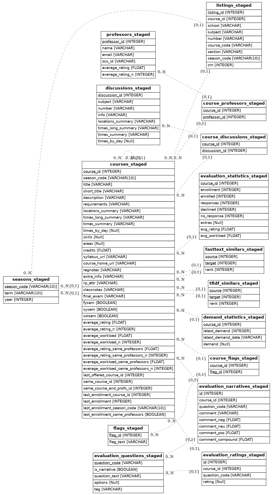

# Parsing

## Schemas

Notes:

- All primary keys and foreign keys will be indexed. Additional indexes will be denoted in the type column.
- Most items have a NOT NULL constraint attached to them.
- Invariant: `listing.season_code == course.season_code if listing.course_id == course.course_id`. Note, this implies that `listingA.season_code == listingB.season_code if listingA.course_id == listingB.course_id`.
- Invariant: every course should have at least one listing.
- Invariant: `evaluation_questions.options is null if evaluation_questions.is_narrative = True`

Mappings:

- seasons -> courses = one to many
- courses -> listings = one to many
- courses <-> professors = many to many (junction table in courses_professors)
- courses -> evaluation_narratives = one to many
- courses -> evaluation_ratings = one to many
- evaluation_questions -> evaluation_narratives = one to many
- evaluation_questions -> evaluation_ratings = one to many

## Layout

### Seasons: `seasons`

| Field         | Type                                       | Description                       |
| ------------- | ------------------------------------------ | --------------------------------- |
| `season_code` | Primary key - String                       | The season code (e.g. "202001")   |
| `term`        | String - one of `spring`, `summer`, `fall` | [computed] Season of the semester |
| `year`        | Integer                                    | [computed] Year of the semester   |

### Courses: `courses`

One entry per class. If a class is listed with multiple course codes, it will only get one entry in this database.
However, different sections of a single class will get multiple entries in this table.

| Field                       | Type        | Description                                                  |
| --------------------------- | ----------- | ------------------------------------------------------------ |
| `course_id`                 | Primary key | Course id                                                    |
| `season_code`               | Foreign key | The season that the course is being taught in, mapping to `seasons` |
| `areas`                     | List        | Course areas (humanities, social sciences, sciences)         |
| `course_home_url`           | String      | Link to the course homepage                                  |
| `description`               | String      | Course description                                           |
| `extra_info`                | String      | Additional information (indicates if class has been canceled) |
| `locations_summary`         | String      | If single location, is `<location>`; otherwise is `<location> + <n_other_locations>` where the first location is the one with the greatest number of days. Displayed in the "Locations" column in CourseTable. |
| `num_students`              | Integer     | [computed] Student enrollment (retrieved from evaluations, not part of the Courses API) |
| `num_students_is_same_prof` | Boolean     | Whether or not a different professor taught the class when it was this size |
| `requirements`              | String      | Recommended requirements/prerequisites for the course        |
| `times_long_summary`        | String      | Course times and locations, displayed in the "Meets" row in CourseTable course modals |
| `times_summary`             | String      | Course times, displayed in the "Times" column in CourseTable |
| `times_by_day`              | Nested      | Course meeting times by day, with days as keys and tuples of `(start_time, end_time, location)` |
| `short_title`               | String      | Shortened course title (first 29 characters + "...") if the length exceeds 32, otherwise just the title itself |
| `skills`                    | List        | Skills that the course fulfills (e.g. writing, quantitative reasoning, language levels) |
| `syllabus_url`              | String      | Link to the syllabus                                         |
| `title`                     | String      | Complete course title                                        |
| `average_overall_rating`    | Float       | [computed] Average overall course rating (from this course's evaluations, aggregated across cross-listings) |
| `average_workload`          | Float       | [computed] Average workload rating (from this course's evaluations, aggregated across cross-listings) |

### Listings: `listings`

Each course code (e.g. "AMST 312 1") and season will get one entry in this database.

| Field         | Type           | Description                                               |
| ------------- | -------------- | --------------------------------------------------------- |
| `listing_id`  | Primary key    | Listing ID                                                |
| `course_id`   | Foreign key    | Course that the listing refers to                         |
| `subject`     | String (index) | Subject the course is listed under (e.g. "AMST")          |
| `number`      | String (index) | Course number in the given subject (e.g. "120" or "S120") |
| `course_code` | String (index) | [computed] subject + number (e.g. "AMST 312")             |
| `section `    | String (index) | Course section for the given subject and number           |
| `season_code` | Foreign key    | When the course/listing is being taught, mapping to `seasons` |
| `crn`         | Int            | The CRN associated with this listing                      |

Additional constraints:

- unique: (season_code, subject, number, section)
- unique: (season_code, crn)

### Professors: `professors`

| Field            | Type           | Description                                                  |
| ---------------- | -------------- | ------------------------------------------------------------ |
| `professor_id`   | Primary key    | Professor ID                                                 |
| `average_rating` | Float          | [computed] Average rating of the professor assessed via the "Overall assessment" question in courses taught |
| `name`           | String (index) | Name of the professor                                        |

### Course-Professor Junction Table `courses_professors`

| Field          | Type        | Description  |
| -------------- | ----------- | ------------ |
| `course_id`    | Foreign Key | Course ID    |
| `professor_id` | Foreign Key | Professor ID |

### Historical Ratings `historical_ratings`

| Field                     | Type           | Description  |
| ------------------------- | -------------- | ------------ |
| `course_code`             | String (index) | Course ID    |
| `professor_id`            | Foreign Key    | Professor ID |
| `course_rating_all_profs` | Float          | [computed]   |
| `course_rating_this_prof` | Float          | [computed]   |
| `course_workload`         | Float          | [computed]   |

### Evaluations (questions): `evaluation_questions`

| Field           | Type                 | Description                                                  |
| --------------- | -------------------- | ------------------------------------------------------------ |
| `question_code` | Primary key - String | Question code (from OCE, e.g. "YC402")                       |
| `is_narrative`  | Bool                 | True if the question has narrative responses                 |
| `question_text` | String               | The question                                                 |
| `options`       | List of strings      | Possible responses (only if the question is categorical)     |
| `tag`           | String               | Question type (used for computing ratings, since one question may be coded differently for different respondants) |

### Evaluations (narrative): `evaluation_narratives`

Narrative evaluations data.

| Field            | Type        | Description                                                  |
| ---------------- | ----------- | ------------------------------------------------------------ |
| `course_id`      | Foreign Key | Course the narrative comment applies to, mapping to `courses` |
| `question_code`  | Foreign Key | Question the answer is a response to, mapping to `evaluation_questions` |
| `comment`        | String      | Response to the question                                     |
| `comment_length` | Integer     | [computed] Length of the response in characters              |

### Evaluations (ratings): `evaluation_ratings`

Categorical evaluations data.

| Field             | Type             | Description                                                  |
| ----------------- | ---------------- | ------------------------------------------------------------ |
| `course_id`      | Foreign Key | Course the narrative comment applies to, mapping to `courses` |
| `question_code` | Foreign Key | Question the answer is a response to, mapping to `evaluation_questions` |
| `ratings` | List of integers | Number of responses for each option. The options are listed in the `evaluation_questions` table |