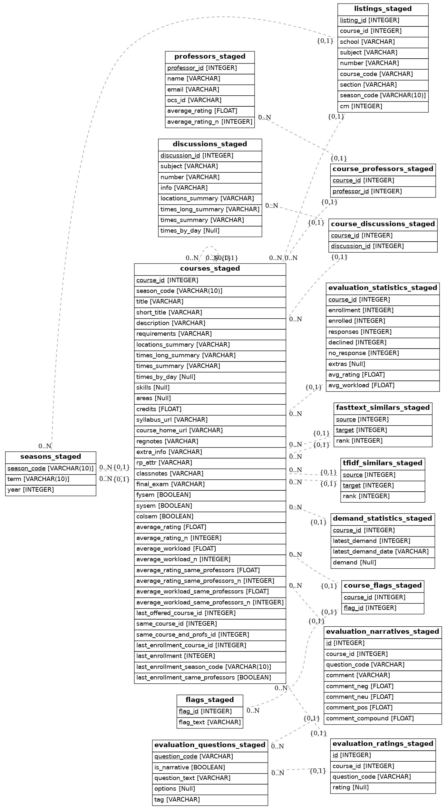

# Parsing and importing

## Parsing courses

Because we extract and construct several fields from courses (e.g. formatted meeting times, syllabus links, cross-listings, cleaned description HTML, etc.) we have a pre-processing step implemented in `/ferry/crawler/parse_classes.py`. This outputs parsed class JSONs per season to `/data/parsed_courses/`.

## Importing

As detailed in the [README](/README.md), our importing process is composed of three stages: transforming, staging, and deploying. Each stage is intended to be as independent as possible (although deploying requires that staging be run before) for ease of development.

### Transforming: `/ferry/transform.py`

Up until this point, most of courses, demand statistics, and evaluations are stored in various JSON files. In this step, we pull together these JSON files and shape them into tables based on our schema with Pandas.

As with retrieval, our tables can be grouped into roughly three categories:

1. Courses
2. Demand statistics
3. Evaluations (and enrollment)

We construct the courses table first, from which we link demand statistics and evaluations. The construction functions are detailed in `/ferry/includes/importer.py`.

After initial construction of the tables, we also populate several "computed" fields. These include mean ratings over the categorical responses, historical ratings over all past offerings of a course, the enrollment for a course the last time it was offered, and others. The computation functions are detailed in `/ferry/includes/computed.py`. An important requirement for these computed fields is identifying the equivalent offerings of a course over several semesters, which is detailed [here](ferry/docs/4_same_classes.md).

### Staging: `/ferry/stage.py`

The staging step is relatively straightforward. We already have CSV tables from the transforming stage, so we just read in these tables and upload them to the database. Note that we wipe all the staging tables at the start of each run, so this step can be rerun before eventual deployment.

### Deploying: `/ferry/deploy.py`

Once our tables are staged, we first check a few invariants (for instance: does every listing have an associated course?). If these variant checks are successful, we upgrade our staged tables to primary ones through SQL rename operations. After this, we reindex the entire database and execute `/resources/search.sql` to set up a [materialized view](https://en.wikipedia.org/wiki/Materialized_view) and full-text search for the website to use.

## Schemas

Notes:

- All primary keys and foreign keys will be indexed. Additional indexes will be denoted in the type column.
- Most items have a NOT NULL constraint attached to them.
- Invariant: `listing.season_code == course.season_code if listing.course_id == course.course_id`. Note, this implies that `listingA.season_code == listingB.season_code if listingA.course_id == listingB.course_id`.
- Invariant: every course should have at least one listing.
- Invariant: `evaluation_questions.options is null if evaluation_questions.is_narrative = True`

Mappings:

- seasons -> courses = one to many
- courses -> listings = one to many
- courses <-> professors = many to many (junction table in courses_professors)
- course -> evaluation_statistics = one to one
- courses -> evaluation_narratives = one to many
- courses -> evaluation_ratings = one to many
- evaluation_narratives <- evaluation_questions = many to one
- evaluation_ratings <- evaluation_questions = many to one

A full description of the schema, along with comments for each field, is available in the SQLAlchemy model: [`/ferry/database/models.py`](ferry/database/models.py).

## Layout

